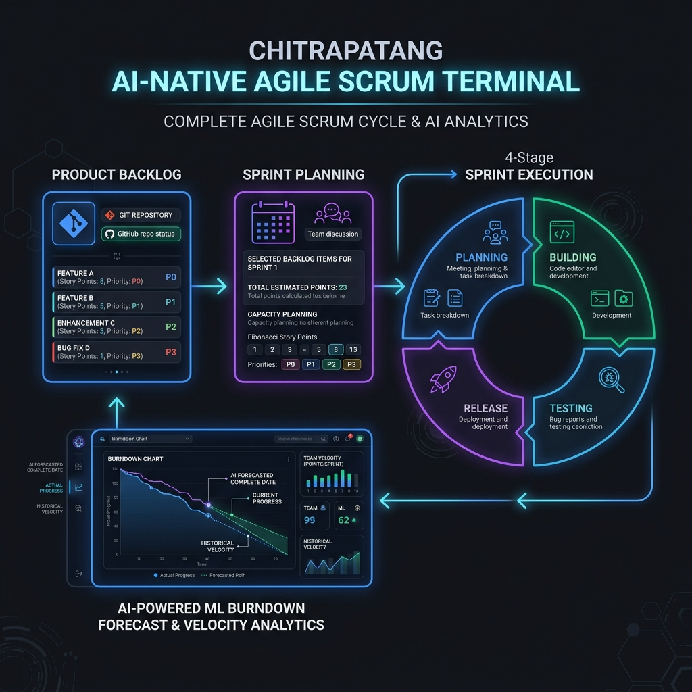

# Chitrapatang Terminal

> **AI-Native Agile Project Management Terminal for Engineering Teams.**

Chitrapatang Terminal is an agile scrum management platform designed specifically for Tech Leads and Engineering Managers to streamline workflows, track project milestones, and coordinate sprint tasks efficiently with predictive ML analytics and autonomous AI orchestration.

---

## Key Features

- **Product & Project Unification:** Directly links GitHub repositories to track product goals, backlog items, and sprint increments.
- **Predictive ML Burndown Analytics:** Machine Learning velocity forecasting and real-time burndown curves to detect delay risks early.
- **Autonomous AI Scrum Master:** AI-assisted standup summaries, velocity tracking, and blocker identification *(planned feature)*.
- **Single-Table Employee Invitations:** Streamlined onboarding flow with manager-approved claim codes and role assignments.
- **Focused Communication:** Hard cap of **4 channels** per workspace (`channel_threshold = 4`) with high-throughput keyset-paginated chat messages.
- **Fibonacci Story Pointing & Priority Levels:** Standardized `P0` to `P3` priority badges and story point estimation scale (`1, 2, 3, 5, 8, 13`).



---


## Folder Structure

This project is structured as a monorepo managed via Turborepo and pnpm workspaces: 

```
chitrapatang/
├── apps/
│   ├── api/                # Express backend API serving tRPC routes
│   ├── web/                # Next.js web application frontend (UI/components/pages)
│   └── tauri-app/          # Tauri desktop client wrapper using Next.js UI
├── docs/                   # Documentation & visual diagrams
│   ├── assets/             # Infographic assets & generated diagrams
│   ├── scrum.md            # Agile Scrum & Product Architecture guide
│   ├── sprint.md           # Project Sprint Planning & Development roadmap
│   ├── AGENT.md            # Agent guidelines, rules, structure, and commit conventions
│   ├── DESIGN_SYSTEM.md    # Design system, tokens, and visual standards
│   └── POSTFIX.md          # Architecture decisions & postfix notes
├── packages/
│   ├── trpc/               # Shared tRPC router definitions and client configurations
│   ├── database/           # Drizzle ORM schemas, migration files, and modular models (user/, workspace/, etc/)
│   ├── logger/             # Winston logger module
│   ├── services/           # Core business logic layer (WorkspaceService, UserService, EmployeeService)
│   ├── utils/              # Shared cryptographic, Redis, and email (Resend SDK) helper utilities
│   ├── eslint-config/      # Shared ESLint configuration rules
│   └── typescript-config/  # Shared TypeScript compiler options
├── README.md               # Getting started instructions and monorepo overview
├── setup.sh                # System initialization script
├── turbo.json              # Turborepo task pipeline configuration
└── pnpm-workspace.yaml     # pnpm workspace package definitions
```

---

## Requirements

- Node.js 18 or later
- `pnpm` package manager

---

## Setup & Running Locally

1. **Initialize environment:**
   ```bash
   chmod +x ./setup.sh
   ./setup.sh
   ```

2. **Install dependencies:**
   ```bash
   pnpm install
   ```

3. **Start local development servers:**
   ```bash
   pnpm dev
   ```

   This runs Turborepo tasks in parallel across `@repo/api`, `web`, and `@repo/database`.

---

## Documentation

- 📘 **[Agile Scrum Guide](docs/scrum.md):** Complete architecture overview, priority levels, 4-stage lifecycle, and ML burndown analytics.
- 📋 **[Project Sprint Planning](docs/sprint.md):** 4-Sprint execution roadmap and story point estimates.
- 🗄️ **[Database Model Architecture](packages/database/models/MODEL.md):** PostgreSQL schema design rules and class table inheritance.

---

## Code of Conduct

### Our Pledge
We pledge to act and interact in ways that contribute to an open, welcoming, diverse, inclusive, and healthy community. We commit to showing respect and professional integrity to all contributors, maintainers, and team members.

---

*Built with Chitrapatang Terminal — AI-Native Agile for modern engineering teams.*
