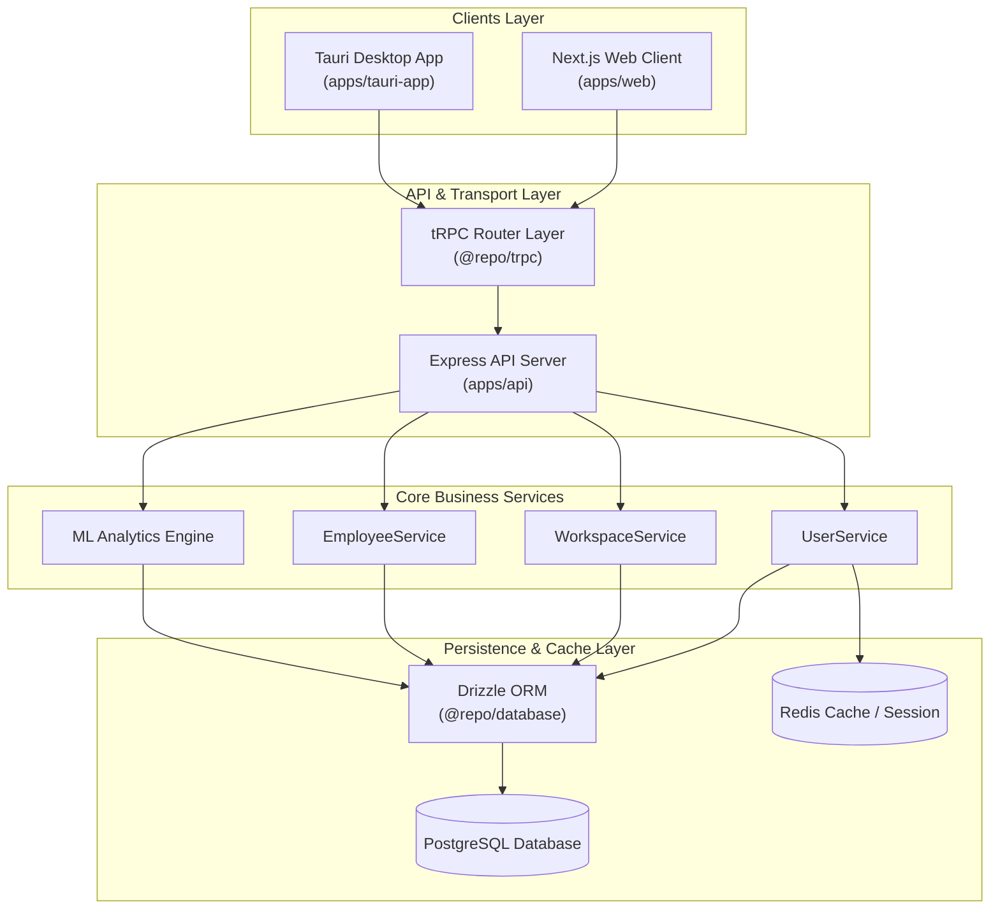

# Chitrapatang Terminal

> **AI-Native Agile Project Management Terminal for Engineering Teams.**

Chitrapatang Terminal is an agile scrum management platform designed specifically for Tech Leads, Product Owners, and Engineering Managers to streamline software delivery, track project milestones, and coordinate sprint tasks efficiently with predictive ML analytics and autonomous AI orchestration.

---

## ⚡ Key Features

- 🎯 **Product & Project Unification:** Directly links GitHub repositories to track product goals, backlog items, and sprint increments seamlessly.
- 📈 **Predictive ML Burndown Analytics:** Machine Learning velocity forecasting and real-time burndown curves to detect schedule delays and workload burnout early in the sprint lifecycle.
- 🤖 **Autonomous AI Scrum Master:** AI-assisted daily standup summaries, velocity tracking, automated blocker identification, and sprint retrospectives.
- 🔐 **Single-Table Employee Invitations:** Streamlined onboarding flow using a normalized state machine (`employees` table) with manager-approved claim codes and role assignments.
- 💬 **Focused Communication & Keyset Pagination:** Hard cap of **4 channels** per workspace (`channel_threshold = 4`) powered by $O(1)$ keyset-paginated high-throughput chat messaging using sequential `BIGSERIAL` cursors.
- 📊 **Fibonacci Story Pointing & SLA Priority Badges:** Standardized `P0` (Critical) to `P3` (Low) priority badges paired with Fibonacci point estimation scales (`1, 2, 3, 5, 8, 13`).
- 🖥️ **Cross-Platform Delivery:** Unified React/Next.js interface available both in modern web browsers and as a native desktop application powered by Tauri and Rust.

---

## 🏗️ High-Level System Architecture



---

## 🛠️ Technology Stack

| Layer | Technologies & Tools |
| :--- | :--- |
| **Frontend Framework** | Next.js 15+ (App Router), React 19, TypeScript |
| **Desktop Client** | Tauri 2.0, Rust, Webview |
| **Styling & Design System** | Tailwind CSS, Lucide Icons, `next-themes`, Apple-grade Glassmorphic UI Tokens |
| **API & RPC Layer** | Express 5, tRPC v11, Zod Validation, OpenAPI generation |
| **Database & ORM** | PostgreSQL, Drizzle ORM, Class Table Inheritance (CTI) |
| **Caching & Messaging** | Redis (`ioredis`), Keyset Cursor Pagination (`BIGSERIAL`) |
| **Authentication & Crypto** | JWT (HttpOnly Cookies), Argon2 Password Hashing (`@repo/utils`) |
| **Monorepo Architecture** | Turborepo, pnpm Workspaces, Shared TypeScript & ESLint Packages |
| **Communication / Email** | Resend SDK, Postfix SMTP Server Integration |

---

## 📂 Repository Monorepo Structure

```
chitrapatang/
├── apps/
│   ├── api/                # Express backend API server serving tRPC routes
│   ├── web/                # Next.js web application frontend (UI/components/pages)
│   ├── tauri-app/          # Tauri desktop client wrapper wrapping Next.js UI
│   └── coming-soon/        # Launch & waitlist landing page application
├── docs/                   # Centralized Documentation directory
│   ├── README.md           # Master Documentation Hub & Sitemap
│   ├── SCRUM.md            # Agile Scrum & Product Architecture guide
│   ├── SYSTEM_DESIGN.md    # Architectural & System Design Patterns guide
│   ├── SPRINT.md           # Project Sprint Planning & Development roadmap
│   ├── FRONTEND_DESIGN.md  # Design system, tokens, and visual standards
│   ├── API_REFERENCE.md    # tRPC Router & API procedure reference
│   ├── AGENT.md            # Agent guidelines, rules, structure, and commit conventions
│   └── POSTFIX.md          # Architecture decisions & postfix email notes
├── packages/
│   ├── trpc/               # Shared tRPC router definitions and client configurations
│   ├── database/           # Drizzle ORM schemas, migration files, and modular models
│   ├── services/           # Core business logic layer (WorkspaceService, UserService, EmployeeService)
│   ├── utils/              # Cryptographic, Redis, Argon2, and email helper utilities
│   ├── logger/             # Winston structured logging module
│   ├── eslint-config/      # Shared ESLint configuration rules
│   └── typescript-config/  # Shared TypeScript compiler configurations
├── .env.example            # Environment variables template
├── README.md               # Getting started instructions and monorepo overview
├── setup.sh                # System initialization script (symlinks .env)
├── turbo.json              # Turborepo task pipeline configuration
└── pnpm-workspace.yaml     # pnpm workspace package definitions
```

---

## 📋 System Requirements

- **Node.js**: `>= 18.0.0`
- **Package Manager**: `pnpm` (version 9.x recommended)
- **Database**: PostgreSQL server instance (`>= 14`)
- **Cache**: Redis server instance
- **Desktop Build (Optional)**: Rust toolchain (`cargo`, `rustc`) for Tauri application compilation

---

## 🚀 Setup & Local Development

1. **Clone & Initialize Environment:**
   ```bash
   chmod +x ./setup.sh
   ./setup.sh
   ```
   *This copies `.env.example` to `.env` and creates symlinks for sub-apps and packages.*

2. **Install Workspace Dependencies:**
   ```bash
   pnpm install
   ```

3. **Configure Environment Variables:**
   Edit `.env` with your local PostgreSQL credentials, Redis host, and JWT secrets.

4. **Generate & Run Database Migrations:**
   ```bash
   pnpm db:generate
   pnpm db:migrate
   ```

5. **Start Local Development Servers:**
   ```bash
   pnpm dev
   ```
   *Runs Turborepo tasks concurrently for `@repo/api`, `web`, and `@repo/database`.*

6. **Launch Tauri Desktop Client (Optional):**
   ```bash
   pnpm tauri:dev
   ```

---

## 📘 Comprehensive Documentation Sitemap

| Category | Document Link | Description |
| :--- | :--- | :--- |
| 📘 **Agile Scrum** | [docs/SCRUM.md](docs/SCRUM.md) | Sprint lifecycle, SLA priority matrix, Fibonacci point scale, and AI Scrum Master. |
| 🏗️ **System Design** | [docs/SYSTEM_DESIGN.md](docs/SYSTEM_DESIGN.md) | CTI database design, keyset pagination, single-table state machine, and tRPC contracts. |
| 📋 **Sprint Roadmap** | [docs/SPRINT.md](docs/SPRINT.md) | 4-Sprint execution plan, story point allocations, ticket statuses, and milestones. |
| 🎨 **Frontend Specs** | [docs/FRONTEND_DESIGN.md](docs/FRONTEND_DESIGN.md) | Design tokens, glassmorphism formula, typography, color palettes, and motion principles. |
| 📡 **API Reference** | [docs/API_REFERENCE.md](docs/API_REFERENCE.md) | Complete tRPC procedures, payload schemas, and authentication cookies reference. |
| 🤖 **Agent Rules** | [docs/AGENT.md](docs/AGENT.md) | Conventions, Git commit standards, flat schema constraints, and agent rules. |
| ✉️ **Mail Configuration** | [docs/POSTFIX.md](docs/POSTFIX.md) | Postfix SMTP relay setup, production Internet Site deployment, and DNS parameters. |
| 🗄️ **Database Models** | [packages/database/models/MODEL.md](packages/database/models/MODEL.md) | PostgreSQL normalized schema specifications, FK constraints, and tables breakdown. |
| 🧰 **Shared Utilities** | [packages/utils/UTILS.md](packages/utils/UTILS.md) | Argon2 hashing, JWT generation, Redis client, and Resend email helpers. |
| 🔌 **tRPC Routes** | [packages/trpc/docs/ROUTES.md](packages/trpc/docs/ROUTES.md) | Sub-router structure, Zod validation models, and OpenAPI route generation. |
| 🍪 **Cookie Auth** | [packages/trpc/docs/COOKIE.md](packages/trpc/docs/COOKIE.md) | Express response cookie factories, auth tokens, and session persistence. |
| 👤 **User Service** | [packages/services/docs/USER.md](packages/services/docs/USER.md) | User registration flow, password hashing, and refresh token session persistence. |
| 🌐 **Express API App** | [apps/api/README.md](apps/api/README.md) | Express tRPC server entrypoint, environment bindings, and tsup build pipeline. |
| 💻 **Next.js Web App** | [apps/web/README.md](apps/web/README.md) | App router pages (`/GetStarted`, `/dashboard`), custom hooks, and UI component hierarchy. |
| 📱 **Tauri Desktop Client** | [apps/tauri-app/README.md](apps/tauri-app/README.md) | Rust desktop wrapper, cross-platform packaging, and native window configuration. |

---

## 📜 Code of Conduct

We commit to an open, welcoming, diverse, and respectful engineering community. All contributors must adhere to professional integrity and collaborative standards across all project interactions.

---

*Built with Chitrapatang Terminal — AI-Native Agile for Modern Engineering Teams.*

