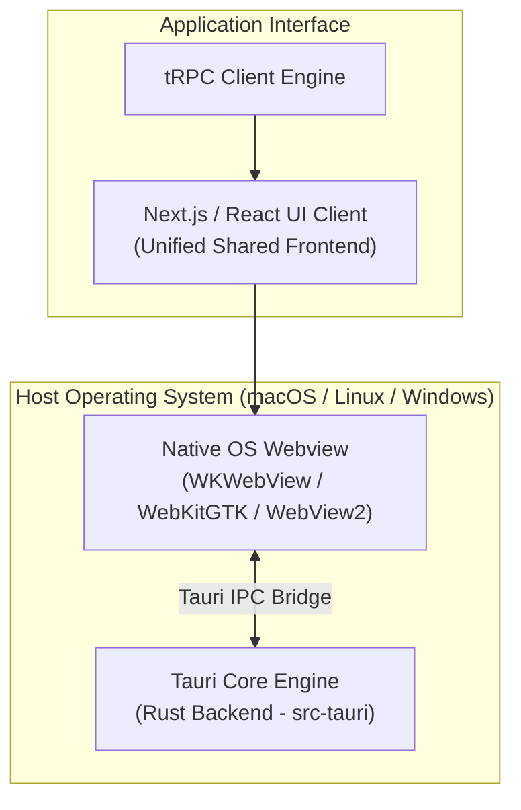

# Chitrapatang Desktop Client (`apps/tauri-app`)

> **Native Desktop Client application powered by Tauri 2.0, Rust, and the unified React UI codebase.**

---

## Overview

The `apps/tauri-app` package wraps the Chitrapatang Terminal React interface inside a native desktop application container using **Tauri 2.0**. This provides engineering managers with a lightweight, secure desktop experience with OS-level window management, low RAM overhead, and native system notification support.

---

## 🛠️ Technology Stack & System Architecture



- **Desktop Framework**: Tauri 2.0 (Rust)
- **Frontend Layer**: Shared React / Next.js interface
- **IPC Protocol**: Asynchronous JSON-RPC over native OS webview bridge

---

## 📋 Platform Prerequisites

Before building or running the Tauri desktop client locally, ensure the following system dependencies are installed:

### 1. Rust Toolchain
- **Install Rust**: `curl --proto '=https' --tlsv1.2 -sSf https://sh.rustup.rs | sh`
- **Verify Version**: `rustc --version` (Requires Rust `1.70+`)

### 2. Linux Dependencies (Ubuntu / Debian)
```bash
sudo apt update
sudo apt install -y build-essential curl wget libssl-dev libgtk-3-dev libwebkit2gtk-4.1-dev libappindicator3-dev librsvg2-dev
```

### 3. macOS Dependencies
- Xcode Command Line Tools: `xcode-select --install`

---

## 🚀 Running & Building Desktop Client

All commands should be run from the root monorepo directory:

```bash
# 1. Launch desktop app in hot-reloading development mode
pnpm tauri:dev

# 2. Build production native desktop installer / binary
cd apps/tauri-app && pnpm tauri build
```

---

## 📂 Directory Layout

```
apps/tauri-app/
├── src-tauri/
│   ├── src/
│   │   ├── main.rs        # Rust entrypoint & Tauri builder
│   │   └── lib.rs         # Commands & native OS IPC handlers
│   ├── tauri.conf.json    # Window size, bundle identifier & permissions config
│   └── Cargo.toml         # Rust crate dependencies
├── package.json           # Scripts & Tauri CLI bindings
└── tauri.svg              # Desktop application icon asset
```

---

## 📘 Documentation Links

- 🏗️ **[System Architecture Patterns](../../docs/SYSTEM_DESIGN.md)**
- 📘 **[Agile Scrum Guide](../../docs/SCRUM.md)**

---

*Chitrapatang Terminal — Native Desktop Client Application.*

