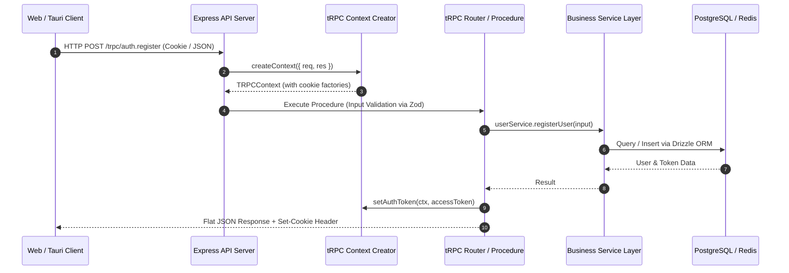

# Chitrapatang Terminal — API Procedure & Router Reference

> **Complete Specification of tRPC Endpoints, Zod Validation Models, Security Contexts, and Response Schemas.**

---

## 🧭 Navigation
[⬅ Master Documentation Hub](README.md) • [Agile Scrum Guide](SCRUM.md) • [System Design](SYSTEM_DESIGN.md) • [Sprint Roadmap](SPRINT.md) • [Frontend Design](FRONTEND_DESIGN.md)

---

## Architecture Overview

Chitrapatang Terminal uses an end-to-end type-safe API built with **tRPC v11** mounted on an **Express 5** server (`apps/api`). Key architectural aspects include:

- **Type Safety**: TypeScript types are inferred automatically from server routers (`@repo/trpc`) by client applications without GraphQL code generation or OpenAPI spec drift.
- **Flat Schemas**: In compliance with project guidelines ([docs/AGENT.md](AGENT.md)), all input/output payloads are flat structures avoiding deep nesting.
- **HTTP-Only Cookies**: Authentication session state is managed via secure, `HttpOnly`, `SameSite=Lax` cookies handled by factory functions.
- **OpenAPI Export**: Every route is annotated with `.meta({ openapi: { method, path, tags } })` allowing automated Swagger/OpenAPI UI generation.



---

## Router Hierarchy

```
serverRouter
├── auth         # Authentication, registration, login, session tokens
├── user         # User profile management & account settings
├── workspace    # Workspace creation, configuration & channels
├── employee     # Employee onboarding, claim codes & invitations
├── ticket       # Sprint backlog tickets, assignments & markdown specs
└── message      # High-throughput keyset-paginated chat messages
```

---

## Procedure Specifications

### 1. Authentication Router (`auth`)

#### `auth.register` (Mutation)
- **Access**: Public
- **OpenAPI**: `POST /authentication/register`
- **Input Schema**:
  ```typescript
  {
    fullName: string; // min length 1, max 88
    email: string;    // valid email address
    password: string; // min length 6
  }
  ```
- **Output Schema**:
  ```typescript
  {
    id: string;       // UUID
    username: string; // User full name
  }
  ```
- **Side Effect**: Sets `authentication_token` HTTP-only cookie and persists a 30-day refresh token in `refresh_tokens` table.

#### `auth.login` (Mutation)
- **Access**: Public
- **OpenAPI**: `POST /authentication/login`
- **Input Schema**:
  ```typescript
  {
    email: string;
    password: string;
  }
  ```
- **Output Schema**:
  ```typescript
  {
    id: string;
    email: string;
    fullName: string;
  }
  ```

#### `auth.logout` (Mutation)
- **Access**: Protected
- **OpenAPI**: `POST /authentication/logout`
- **Input Schema**: `undefined`
- **Output Schema**: `{ success: boolean }`
- **Side Effect**: Clears `authentication_token` cookie and revokes session tokens.

---

### 2. Workspace Router (`workspace`)

#### `workspace.create` (Mutation)
- **Access**: Protected (Workspace Owner)
- **OpenAPI**: `POST /workspace/create`
- **Input Schema**:
  ```typescript
  {
    name: string;      // Workspace title
    slug: string;      // URL slug (unique)
    repoUrl?: string;  // GitHub Repository URL link
  }
  ```
- **Output Schema**:
  ```typescript
  {
    workspaceId: string;
    ownerId: string;
    channelThreshold: number; // Enforced hard cap = 4
    channelsCount: number;
    createdAt: string;
  }
  ```

#### `workspace.createChannel` (Mutation)
- **Access**: Protected (Workspace Owner / Manager)
- **OpenAPI**: `POST /workspace/channel`
- **Input Schema**:
  ```typescript
  {
    workspaceId: string;
    channelName: string;
  }
  ```
- **Guardrail Check**: Throws `TRPCError({ code: "BAD_REQUEST" })` if `channels_count >= channel_threshold (4)`.

---

### 3. Employee Invitation Router (`employee`)

#### `employee.invite` (Mutation)
- **Access**: Protected (Workspace Manager / Scrum Master)
- **Input Schema**:
  ```typescript
  {
    workspaceId: string;
    role: string; // e.g. "Lead Developer", "QA Engineer"
  }
  ```
- **Output Schema**:
  ```typescript
  {
    inviteCode: string; // Unique claim code generated
    status: "pending";
  }
  ```

#### `employee.claimInvite` (Mutation)
- **Access**: Protected (Authenticated User)
- **Input Schema**:
  ```typescript
  {
    inviteCode: string;
  }
  ```
- **Behavior**: Claims single-table invitation record. Transitions employee state from `pending` to awaiting manager approval with `userId` linked.

---

### 4. Keyset Chat Message Router (`message`)

#### `message.listMessages` (Query)
- **Access**: Protected (Active Workspace Member)
- **Input Schema**:
  ```typescript
  {
    channelId: string;
    cursorId?: number; // BIGSERIAL ID cursor for O(1) pagination
    limit?: number;    // Default: 50, Max: 100
  }
  ```
- **Output Schema**:
  ```typescript
  {
    messages: Array<{
      id: number;        // BIGSERIAL
      channelId: string;
      senderId: string;
      senderName: string;
      content: string;
      createdAt: string;
    }>;
    nextCursorId: number | null;
  }
  ```

---

## Standard Error Handling & Status Codes

| tRPC Error Code | HTTP Status | Description / Common Cause |
| :--- | :--- | :--- |
| `BAD_REQUEST` | `400` | Input validation failure or limit exceeded (e.g. channel cap reached). |
| `UNAUTHORIZED` | `401` | Missing, expired, or invalid JWT access cookie. |
| `FORBIDDEN` | `403` | Insufficient privileges (e.g. non-manager trying to approve invite). |
| `NOT_FOUND` | `404` | Workspace, ticket, channel, or user record does not exist. |
| `CONFLICT` | `409` | Email already registered or slug already taken. |
| `INTERNAL_SERVER_ERROR` | `500` | Unhandled exception, database connection failure, or Redis outage. |

---

*Chitrapatang Terminal — API Procedure Reference.*
