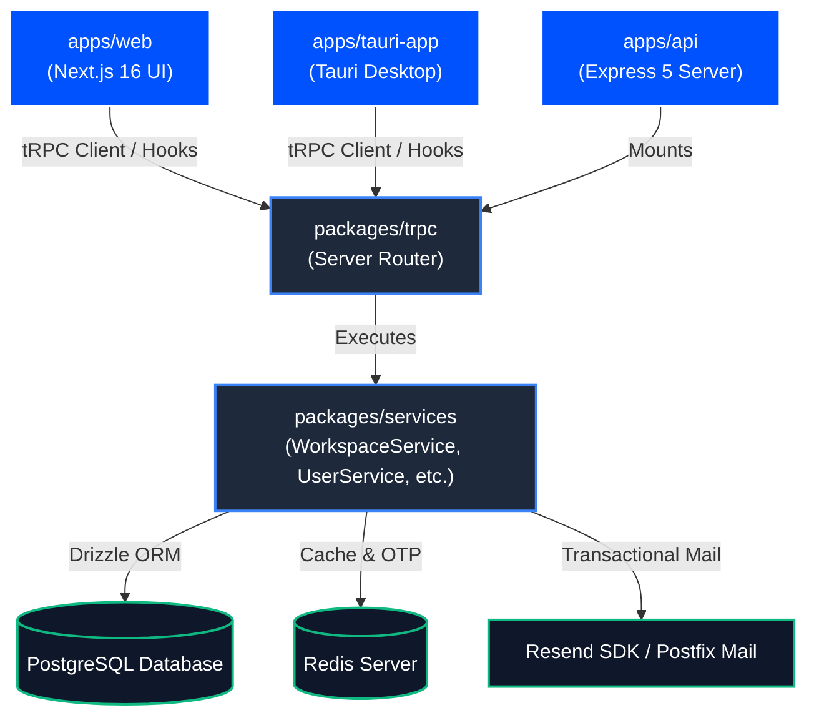

# Chitrapatang Terminal — Master Documentation Hub

> **Central Documentation Directory, Architectural Sitemap, and Specifications for Engineering Teams.**

---

## 🧭 Navigation Matrix

| Document | Primary Focus | Target Audience |
| :--- | :--- | :--- |
| 📘 **[Agile Scrum Architecture](SCRUM.md)** | Scrum framework, priority tiers (P0-P3), 4-stage sprint cycle, ML burndown analytics | Product Owners, Scrum Masters, Leads |
| 📋 **[Sprint Roadmap & Backlog](SPRINT.md)** | Sprints 1–4 execution plan, Fibonacci point estimations, ticket mapping | Developers, QA Engineers |
| 🏗️ **[System Design & Architecture](SYSTEM_DESIGN.md)** | System design patterns, Class Table Inheritance, state machines, $O(1)$ keyset pagination | System Architects, Backend Engineers |
| 🔌 **[API Router & Procedure Spec](API_REFERENCE.md)** | tRPC v11 procedure endpoints, Zod validation models, cookie security, error matrix | Full-Stack Developers, Integrators |
| 🎨 **[Unified Design System](FRONTEND_DESIGN.md)** | Color tokens (OKLCH), typography scale, glassmorphism CSS formulas, motion keyframes | UI/UX Designers, Frontend Engineers |
| 📮 **[Postfix Mail Server Setup](POSTFIX.md)** | Local SMTP relay setup, production DNS (MX/SPF/DKIM/DMARC), TLS certificate configuration | DevOps, System Administrators |
| 🤖 **[Agent Guidelines & Rules](AGENT.md)** | Engineering constraints, flat schema design, folder tree, conventional commits | AI Agents, Contributors |
| 🗄️ **[Database Model Rules](../packages/database/models/MODEL.md)** | Drizzle ORM schemas, migration rules, modular model structure | Database Engineers, Backend Developers |

---

## 🏛️ System Architecture Overview

Chitrapatang Terminal is an AI-Native Agile Scrum platform designed for high-velocity software engineering teams. The architecture is organized as a Turborepo monorepo with strict package boundaries:

---

## ⚡ Core Technical Pillars

1. **Type Safety Across Boundaries**: End-to-end TypeScript type inference via tRPC v11 without code generation steps.
2. **Flat Schema Design**: Strict adherence to flat input/output payloads to minimize serialization overhead and prevent nested object drift.
3. **High-Performance Messaging**: Keyset (cursor-based) pagination on `BIGSERIAL` message IDs guaranteeing $O(1)$ chat query performance.
4. **Single-Table Onboarding State Machine**: Encapsulating employee invitations within a single PostgreSQL table (`employees`) using status enums (`pending` → `active` | `rejected`).
5. **Predictive Burndown Engine**: Machine learning regression models predicting sprint completion likelihood based on historical velocity and workload density.

---

## 📚 Key Concepts Summary

### Priority Matrix
- **`P0` (Critical/Blocker)**: System outage, core architecture, or fundamental blocker.
- **`P1` (High)**: Essential feature required for sprint milestone delivery.
- **`P2` (Medium)**: Quality-of-life enhancements and non-critical feature additions.
- **`P3` (Low)**: Minor UI polish, documentation updates, or backlog ideas.

### 4-Stage Sprint Lifecycle
$$\text{planning} \xrightarrow{\quad\text{assign}\quad} \text{building} \xrightarrow{\quad\text{review}\quad} \text{testing} \xrightarrow{\quad\text{verify}\quad} \text{release}$$

---

*Chitrapatang Terminal — Master Documentation Index.*
