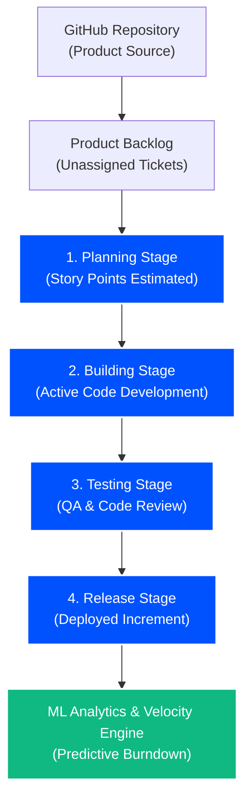
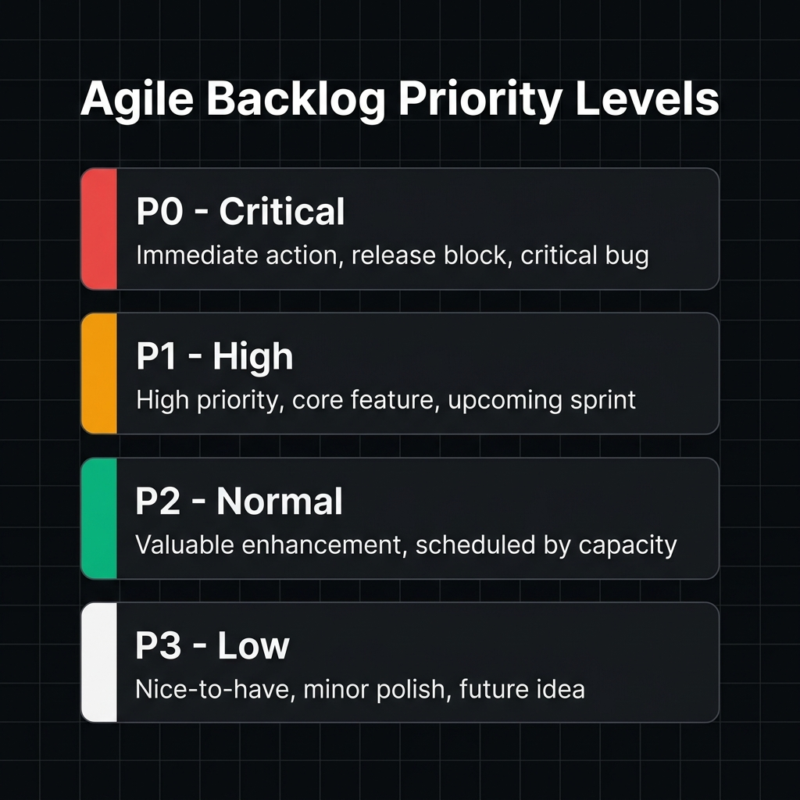
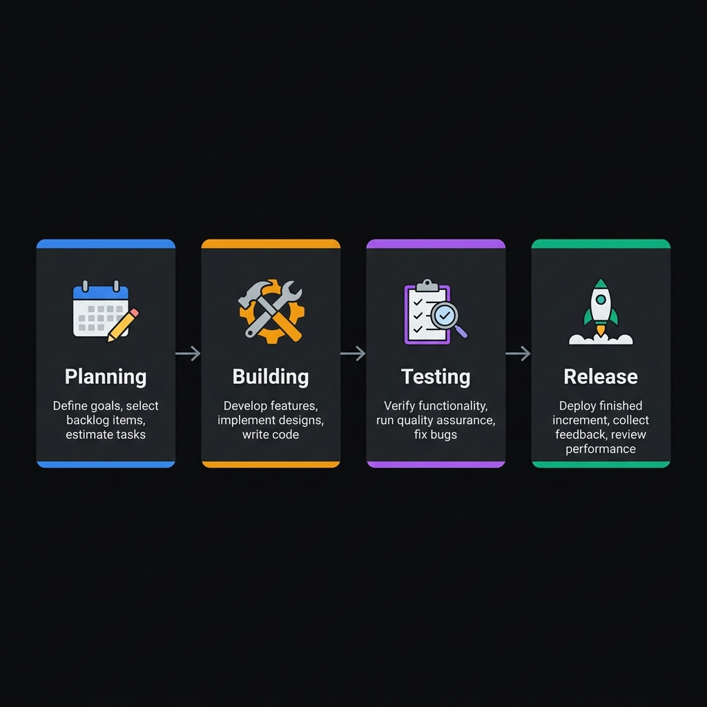
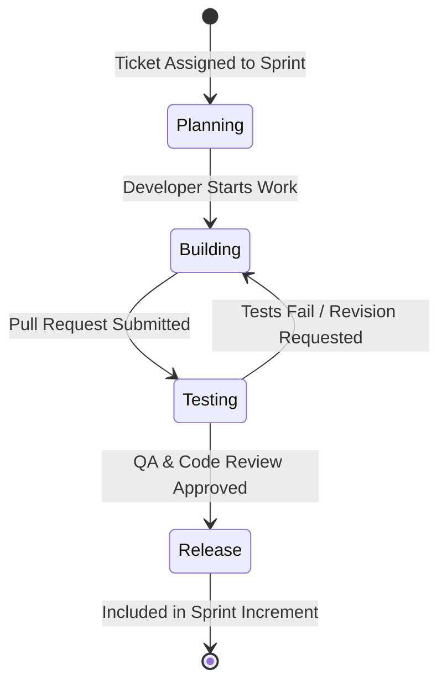
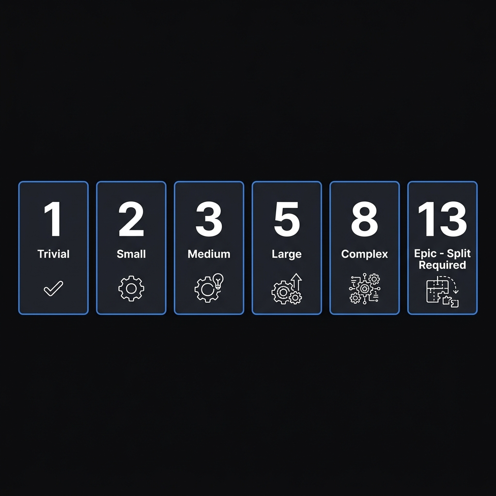
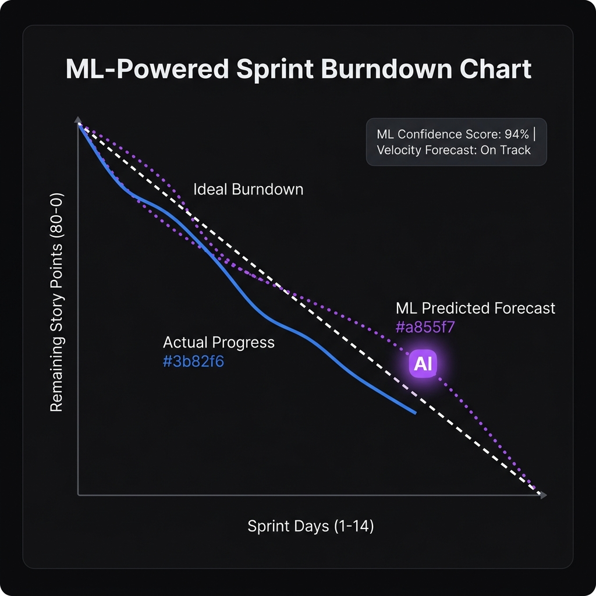

# Chitrapatang Terminal — Agile Scrum & Product Architecture Guide

> **Core Scrum Framework Specifications, Priority Tiers, 4-Stage Sprint Lifecycle, and ML Burndown Analytics.**

---

## 🧭 Navigation
[⬅ Master Documentation Hub](README.md) • [System Design](SYSTEM_DESIGN.md) • [Sprint Roadmap](SPRINT.md) • [API Reference](API_REFERENCE.md) • [Frontend Design](FRONTEND_DESIGN.md)

---

## Executive Summary

Chitrapatang Terminal is designed around a unified **Product & Project Model**. Instead of decoupling developer tasks from product objectives, tickets and sprints share a unified architectural lifecycle linked directly to GitHub repositories.



---

## 1. Roles & Agile Responsibilities

| Agile Role | Platform Mapping | Primary Responsibilities |
| :--- | :--- | :--- |
| **Product Owner (PO)** | Workspace Owner (`role = "owner"`) | Manages product backlog, defines feature acceptance criteria, connects GitHub repositories. |
| **Scrum Master (SM)** | Manager Employee / AI Agent (`role = "manager"`) | Facilitates sprint ceremonies, generates employee invite codes, tracks velocity, manages access keys (`read_key`, `write_key`). |
| **Development Team** | Active Employees (`status = "active"`) | Self-organizing engineers who estimate story points, execute tickets, and transition work through the sprint lifecycle. |
| **Autonomous AI Agent** | System Service Worker | Performs automated daily standup summaries, predicts completion bottlenecks, flags over-allocated developers. |

---

## 2. Priority Tiers (P0 – P3)

All tickets and sprint work items must be tagged with a strict priority level:



| Tier | Priority Level | SLA / Attention Target | Guidelines & Context |
| :--- | :--- | :--- | :--- |
| **P0** | **Critical / Blocker** | Immediate (< 24 Hours) | Production outages, core database migration failures, broken authentication, security vulnerabilities. |
| **P1** | **High** | Current Sprint Target | Primary product features, essential API procedures, core UI workflows necessary for sprint delivery. |
| **P2** | **Medium** | Scheduled Next Sprint | Secondary enhancements, performance optimizations, non-blocking bug fixes. |
| **P3** | **Low** | Backlog / Flexible | Minor cosmetic polish, internal developer tooling, documentation refactoring. |

---

## 3. Four-Stage Sprint Lifecycle

Work items in a sprint move through four distinct, non-skippable stages during development:





| Stage Index | Enum Key | Description & Triggers |
| :---: | :--- | :--- |
| **1** | `planning` | Backlog item selected for sprint, estimated in Fibonacci story points, and assigned to engineers. |
| **2** | `building` | Active development, feature implementation, and local unit test writing. |
| **3** | `testing` | Quality assurance, automated CI test execution, code review, and bug resolution. |
| **4** | `release` | Verified increment deployed to production or packaged into Tauri desktop release builds. |

---

## 4. Estimation & Story Points

Chitrapatang uses standard **Fibonacci Story Pointing** to measure relative complexity:



$$\text{Story Points} \in \{1, 2, 3, 5, 8, 13\}$$

- **1 – 2 Points:** Minor bug fixes, quick UI text updates, utility additions.
- **3 – 5 Points:** Medium features, new tRPC procedure endpoints, schema updates.
- **8 – 13 Points:** Major subsystem implementations, complex architectural refactors. *Items $\ge 13$ points must be split before sprint commitment.*

---

## 5. Security Token Architecture & Audit Logs

Sprint access and board mutations are protected by dynamic security keys:

```
┌─────────────────────────────────────────────────────────────┐
│                       SPRINT SECURITY                       │
│                                                             │
│  Read Key (read_key)    ──► Grants read-only access to      │
│                             sprint board & tickets          │
│                                                             │
│  Write Key (write_key)  ──► Grants mutation rights for      │
│                             stage updates & ticket edits    │
└─────────────────────────────────────────────────────────────┘
```

- **Granular Permissions:** Product Owners and Scrum Masters grant read/write access to specific employee accounts.
- **Audit Logging:** Every read and write operation is recorded in dedicated `read_logs` and `write_logs` tables to maintain complete compliance and security transparency.

---

## 6. Predictive ML Burndown & Velocity Engine

Chitrapatang Terminal integrates Machine Learning models to provide intelligent sprint velocity forecasting and predictive burndown statistics:



- **Predictive Burndown Curve (ML Integration):** Machine Learning regression models analyze historical team velocity, ticket story points, commit frequencies, and individual workloads to project real-time completion curves against ideal sprint linear progression.
- **Completion Rate Forecasting:** Predicts the probability of completing all committed sprint tickets before the deadline, flagging delay risks early in the `building` phase.
- **Developer Workload & Burnout Statistics:** Uses statistical analysis and workload metrics to identify over-allocated team members, helping managers prevent developer fatigue and balance task assignments.
- **Sprint Velocity:** Automated tracking of story points transitioned to `finished` per sprint cycle.

---

*Chitrapatang Terminal — Agile Scrum Architecture Specification.*
