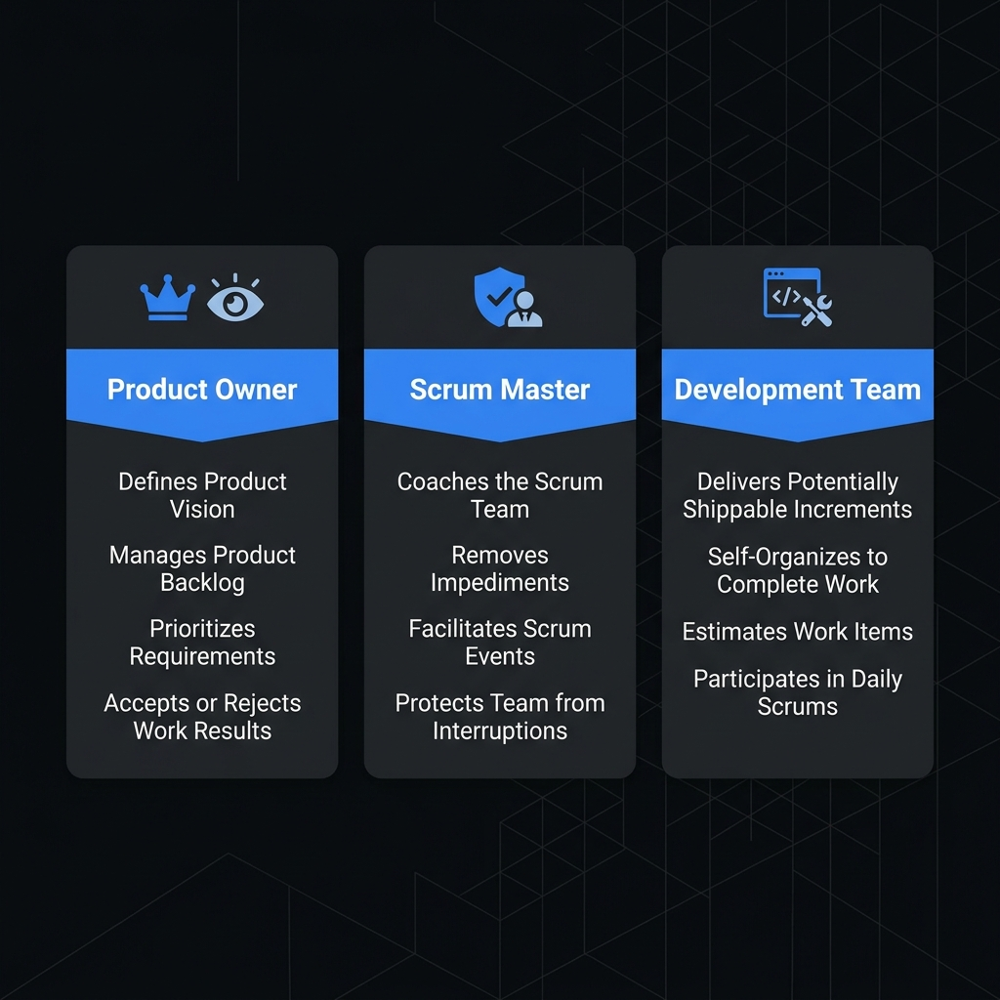
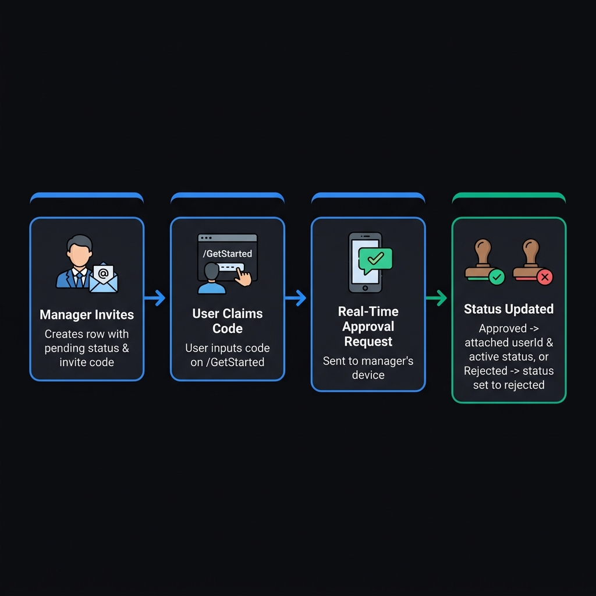
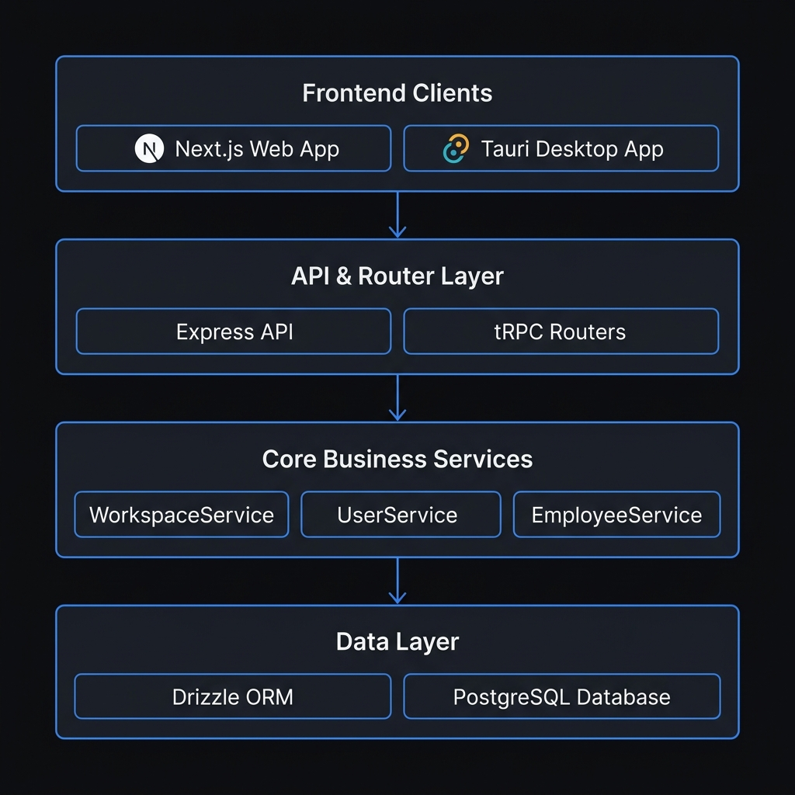

# Chitrapatang Terminal — Agile Scrum & Product Architecture

> **AI-Native Agile Project Management for Engineering Teams.**
>
> This document outlines how the Scrum framework and Product/Sprint concepts are applied within Chitrapatang Terminal — from workspace creation to ticket delivery, security access tokens, and autonomous AI orchestration.

---

## 1. Vision & Core Principles

Chitrapatang Terminal is designed to streamline engineering workflows by uniting software product management, sprint execution, and automated AI agents into a single developer-first platform.

- **Product & Project Unification:** In Chitrapatang, a **Product** and a **Project** represent the same entity. The Product Owner (Workspace Owner) links their GitHub repository directly to manage product goals, tickets, and sprint releases.
- **Autonomous AI Scrum Master:** In addition to human managers, Chitrapatang integrates an **Autonomous AI Agent** to act as a co-Scrum Master — assisting with backlog grooming, standup summaries, automated sprint velocity tracking, and blocker detection *(coming in AI release once core application logic is complete)*.

---

## 2. Priority Level Definitions

Every ticket and backlog item in Chitrapatang is assigned a strict priority level to govern engineering focus and release order.


| Level | Priority Name | Visual Badge | Description & SLA |
|-------|---------------|--------------|-------------------|
| **P0** | **Critical** | 🔴 Red | Immediate action required. Production outages, security vulnerabilities, or release blockers. Must be resolved before any other work. |
| **P1** | **High** | 🟡 Yellow | Priority for the current/upcoming sprint. Core feature developments and major improvements. |
| **P2** | **Normal** | 🟢 Green | Valuable enhancement, non-urgent. Scheduled based on team capacity during sprint planning. |
| **P3** | **Low** | ⚪ White | Minor polish, technical debt, refactoring, or future ideas. |

---

## 3. Scrum Roles & Agent Integration



### Role Mapping in Chitrapatang

| Scrum Role | Chitrapatang Equivalent | Primary Responsibilities |
|------------|-------------------------|--------------------------|
| **Product Owner** | Workspace Owner (`workspaces.owner_id`) | Defines product vision, links GitHub repositories, manages product backlog, and approves employee invitations. |
| **Scrum Master** | Manager Employee / Autonomous AI Agent | Facilitates sprint ceremonies, generates employee invite codes, manages sprint read/write access keys, and tracks team velocity. |
| **Development Team** | Active Employees (`status = "active"`) | Self-organizing engineers who estimate story points, execute tickets, and transition work through the sprint lifecycle. |

### Employee Invitation Flow

The single-table invitation system (`employees` table) manages onboarding:



---

## 4. Four-Stage Sprint Lifecycle

Work items in a sprint move through four distinct states during development:


| Stage | Enum Key | Description |
|-------|----------|-------------|
| **1. Planning** | `planning` | Backlog item selected for sprint, estimated in story points, and assigned to engineers. |
| **2. Building** | `building` | Active development, feature implementation, and code writing. |
| **3. Testing** | `testing` | Quality assurance, automated test suite runs, code reviews, and bug fixes. |
| **4. Release** | `release` | Verified increment deployed to production or target release build. |

> *Note: Application schemas allow future extensibility for dynamic user-defined custom states.*

---

## 5. Estimation & Story Points

Chitrapatang uses standard **Fibonacci Story Pointing** to measure relative complexity and effort:


$$\text{Story Points} \in \{1, 2, 3, 5, 8, 13\}$$

- **1 – 2 Points:** Small tasks, quick bug fixes, simple UI tweaks.
- **3 – 5 Points:** Medium feature development, new API endpoints, database schema updates.
- **8 – 13 Points:** Complex architectural changes, major subsystem implementations. Items $\ge 13$ must be broken down during Sprint Planning.

---

## 6. Access Control, Security Keys & Audit Logs

To protect sprint data and enable secure API integrations, Chitrapatang enforces dynamic read and write access keys per sprint:

```
┌─────────────────────────────────────────────────────────────┐
│                       SPRINT SECURITY                       │
│                                                             │
│  Read Key (read_key)    ──► Grants read-only access to      │
│                             sprint board & tickets          │
│                                                             │
│  Write Key (write_key)  ──► Grants mutation rights for      │
│                             stage updates & ticket edits    │
└─────────────────────────────────────────────────────────────┘
```

- **Granular Permissions:** Product Owners and Scrum Masters grant read/write access to specific employee accounts.
- **Audit Logging:** Every read and write operation is recorded in dedicated `read_logs` and `write_logs` tables to maintain complete compliance and security transparency.

---

## 7. Sprint Performance, Predictive ML & Burndown Analytics

Chitrapatang Terminal integrates Machine Learning models to provide intelligent sprint velocity forecasting and predictive burndown statistics:


- **Predictive Burndown Curve (ML Integration):** Machine Learning regression models analyze historical team velocity, ticket story points, commit frequencies, and individual workloads to project real-time completion curves against ideal sprint linear progression.
- **Completion Rate Forecasting:** Predicts the probability of completing all committed sprint tickets before the deadline, flagging delay risks early in the `building` phase.
- **Developer Workload & Burnout Statistics:** Uses statistical analysis and workload metrics to identify over-allocated team members, helping managers prevent developer fatigue and balance task assignments.
- **Sprint Velocity:** Automated tracking of story points transitioned to `finished` per sprint cycle.

---

## 8. System Data Flow & Architecture



---

## 9. Summary of System Artifacts

- **`docs/scrum.md`**: Complete Agile Scrum architecture & product vision guide.
- **`docs/sprint.md`**: Dedicated sprint execution, backlog management, and technical schema specification.
- **`packages/database/models/MODEL.md`**: Database relational schema specification.
