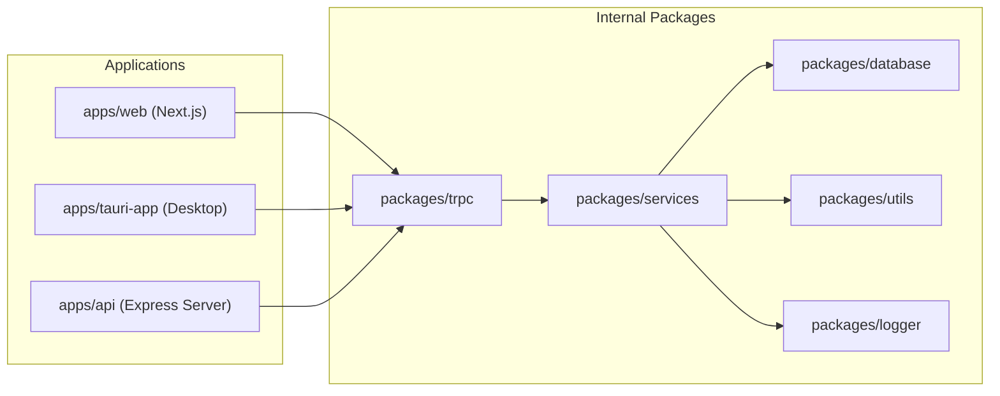
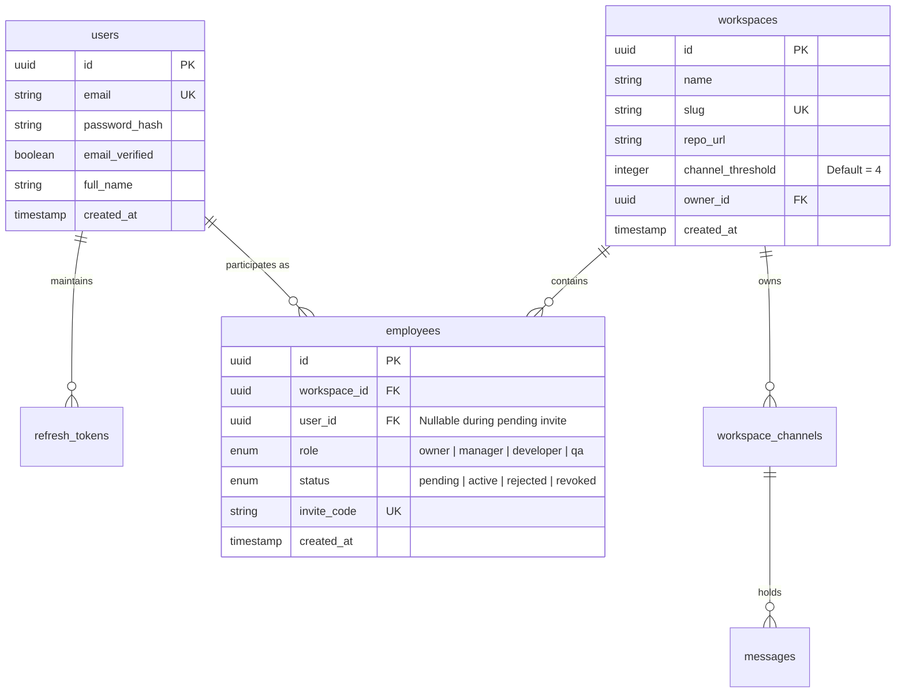
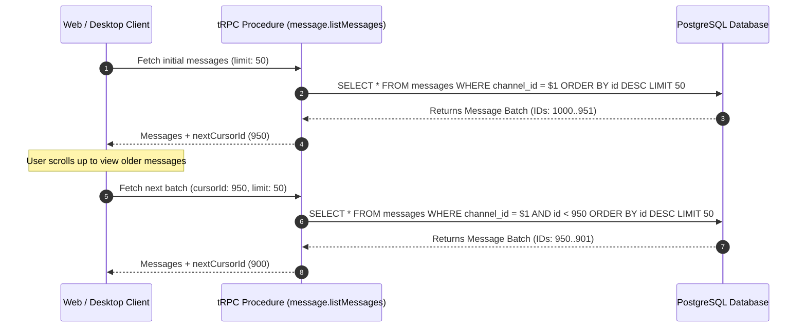
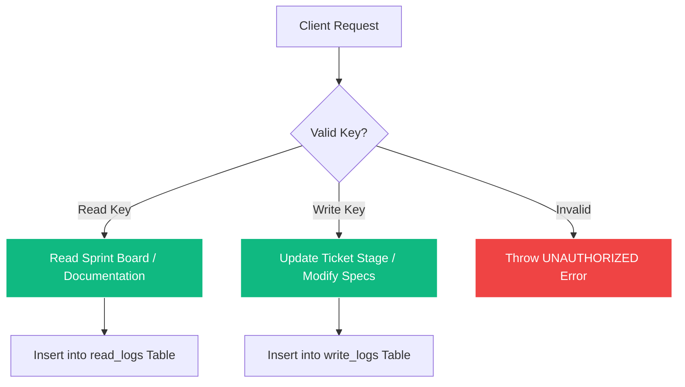

# Chitrapatang Terminal — System Design & Architecture Patterns

> **Complete Reference of Distributed System Patterns, Database Schemas, State Machines, and API Guardrails.**

---

## 🧭 Navigation
[⬅ Master Documentation Hub](README.md) • [Agile Scrum Guide](SCRUM.md) • [Sprint Roadmap](SPRINT.md) • [API Reference](API_REFERENCE.md) • [Frontend Design](FRONTEND_DESIGN.md)

---

## Executive Summary

Chitrapatang Terminal implements industry-standard software architecture patterns to deliver an ultra-fast, resilient, and type-safe developer experience.

```
┌───────────────────────────────────────────────────────────────────────────┐
│                        SYSTEM DESIGN PATTERNS                             │
│                                                                           │
│  1. Monorepo Architecture (Turborepo + pnpm Workspaces)                  │
│  2. Class Table Inheritance (CTI) Database Pattern                        │
│  3. Single-Table Onboarding State Machine (Employees)                     │
│  4. Keyset (Cursor-Based) Pagination Pattern                              │
│  5. End-to-End Type-Safe RPC (tRPC v11 Architecture)                      │
│  6. Bounded Context & Application Guardrails (4-Channel Hard Cap)        │
│  7. Dynamic Token Authorization & Append-Only Audit Logging               │
│  8. Shared Cross-Platform UI Architecture (Next.js + Tauri Desktop)       │
│  9. Time-Series ML Predictive Burndown & Velocity Engine                  │
└───────────────────────────────────────────────────────────────────────────┘
```

---

## 1. Monorepo Architecture (Turborepo + pnpm Workspaces)

Chitrapatang decouples business logic into reusable internal packages while maintaining distinct application entry points:



### Key Architectural Advantages
- **Single Source of Truth**: Data models defined once in `@repo/database` and used everywhere.
- **Shared Configuration**: `@repo/typescript-config` and `@repo/eslint-config` enforce strict linting and compilation rules across all modules.
- **Turborepo Pipeline Caching**: `turbo.json` caches build artifacts and test outputs for instantaneous rebuilds.

---

## 2. Class Table Inheritance (CTI) Database Pattern

### Decoupling Identity from Workspace Membership
To maintain Third Normal Form (3NF) and prevent identity duplication, user credentials sit in a base `users` table, while workspace roles sit in a separate `employees` domain table.



---

## 3. Single-Table Onboarding State Machine

### Nullable Foreign Key Pattern for Employee Invitations
Rather than using temporary invitation tables or complex join logic, employee onboarding is modeled as a state machine inside the `employees` table:

```mermaid
stateDiagram-v2
    [*] --> Pending : Manager executes employee.invite
    
    state Pending {
        note right of Pending
            userId = NULL
            status = 'pending'
            inviteCode = 'CP-INV-8921'
        end note
    }

    Pending --> Active : Manager Approves Claim Code
    state Active {
        note right of Active
            userId = <claimed_user_uuid>
            status = 'active'
            inviteCode = NULL
        end note
    }

    Pending --> Rejected : Manager Rejects Claim Code
    state Rejected {
        note right of Rejected
            userId = <claimed_user_uuid>
            status = 'rejected'
            Row retained for audit trail
        end note
    }

    Active --> Revoked : Manager Revokes Access
```

---

## 4. Keyset (Cursor-Based) Pagination Pattern

### $O(1)$ Real-Time Chat Message Retrieval
Offset-based pagination (`OFFSET 1000`) degrades to $O(N)$ query times as message volume grows. Chitrapatang uses PostgreSQL `BIGSERIAL` auto-incrementing integers (`id`) for $O(1)$ keyset pagination:



### SQL Query Execution
```sql
SELECT id, channel_id, sender_id, content, created_at
FROM messages
WHERE channel_id = $1 AND id < $cursor_id
ORDER BY id DESC
LIMIT 50;
```

---

## 5. End-to-End Type-Safe RPC (tRPC v11 Architecture)

Client applications infer complete router types without code generation or OpenAPI spec drift:

```
┌─────────────────────────────────┐       Infers ServerRouter       ┌─────────────────────────────────┐
│        Next.js / Tauri App      │ ──────────────────────────────► │       Express API Server        │
│   useQuery(['workspace.get'])   │ ◄────────────────────────────── │       (packages/trpc)           │
└─────────────────────────────────┘        Typed Data Payload       └─────────────────────────────────┘
```

---

## 6. Bounded Context & Application Guardrails

1. **4-Channel Hard Cap**: Every workspace schema includes `channel_threshold INTEGER DEFAULT 4`. Creating a 5th channel throws a `BAD_REQUEST` error at both service and DB level.
2. **Flat Payload Constraint**: All procedure responses must return flat object structures to minimize JSON parsing complexity and serialization latency.

---

## 7. Dynamic Token Security & Append-Only Audit Logging

Sprint data access is governed by dynamic keys (`read_key`, `write_key`):



---

## 8. Machine Learning Predictive Analytics Engine

Machine learning regression models analyze historical team velocity, ticket story point distribution, and developer commit frequency to calculate real-time completion forecasts:

$$\text{Burndown Forecast}(t) = \text{Initial Points} - \sum_{i=1}^{t} \text{Velocity}_{\text{actual}}(i) - \hat{\beta}_{\text{ML}} \cdot \Delta t$$

---

*Chitrapatang Terminal — System Design Specifications.*
